# TidyTuesday: Tour de France

  

  

TidyTuesday is a weekly data project in R. The task is to wrangle and explore the data with the tools that R provides. This weeks TidyTuesday dataset is about Tour de France results.

[You can find the github repo with the data here](https://github.com/gkaramanis/tidytuesday/blob/master/2020-week15/tour-de-france.R)

  

You can find the analysis script in the .Rmd file, or look at the plots the code outputs below. 

  

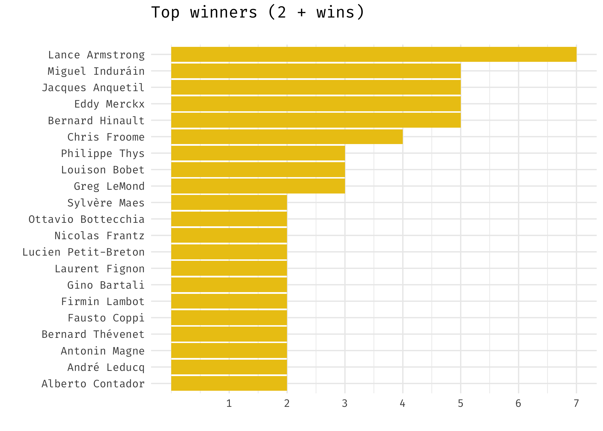 
   
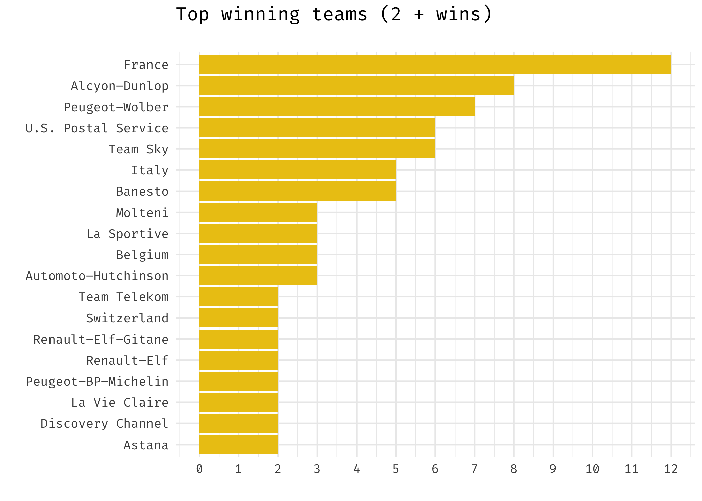
   
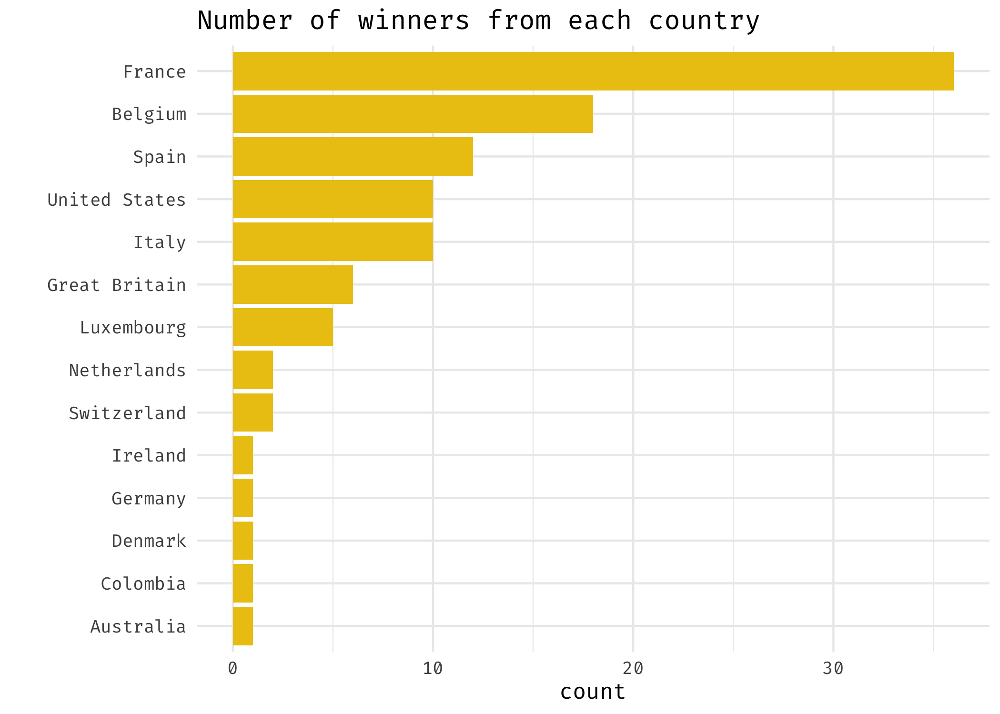
   
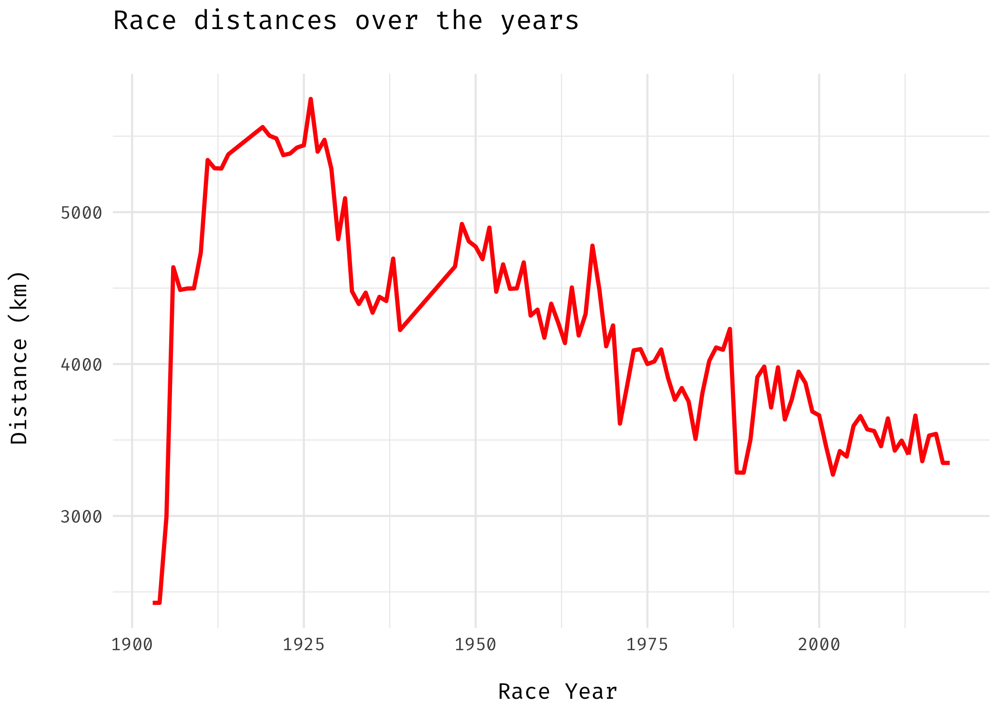
   
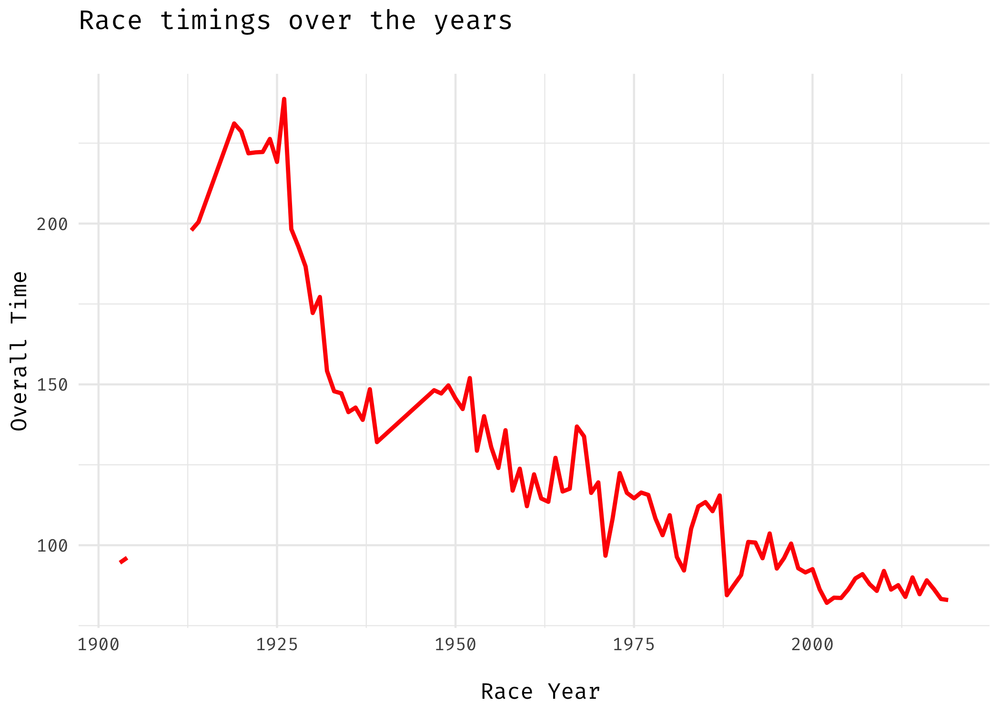
   
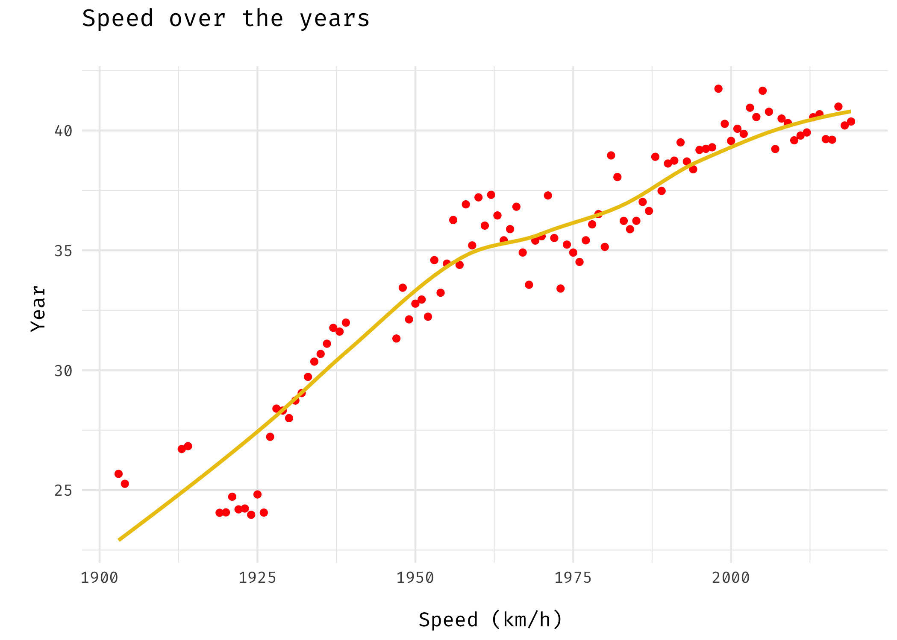
   
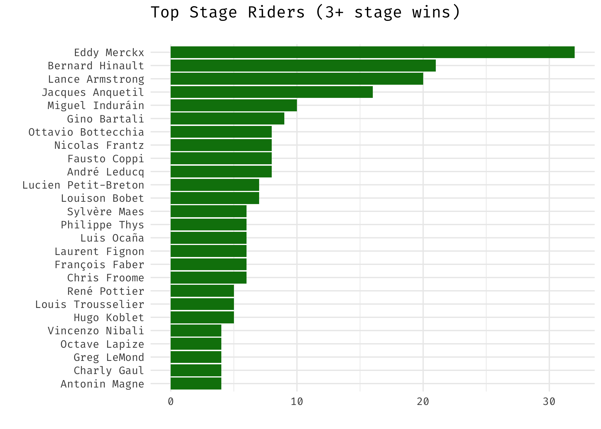
   
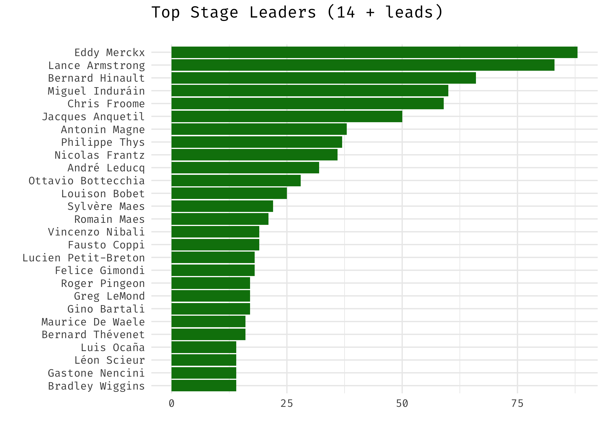
   
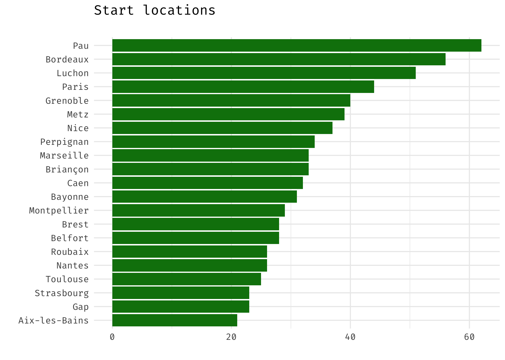
   
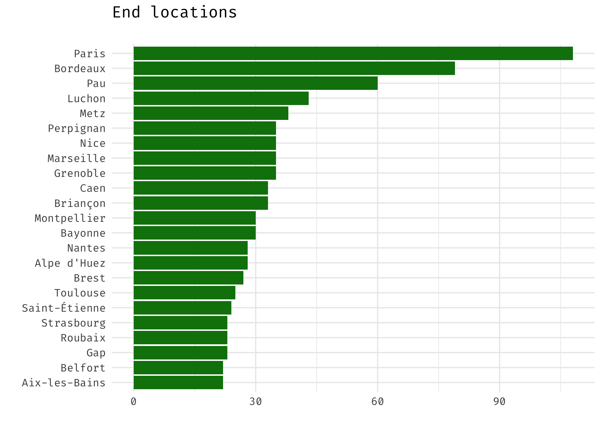
   
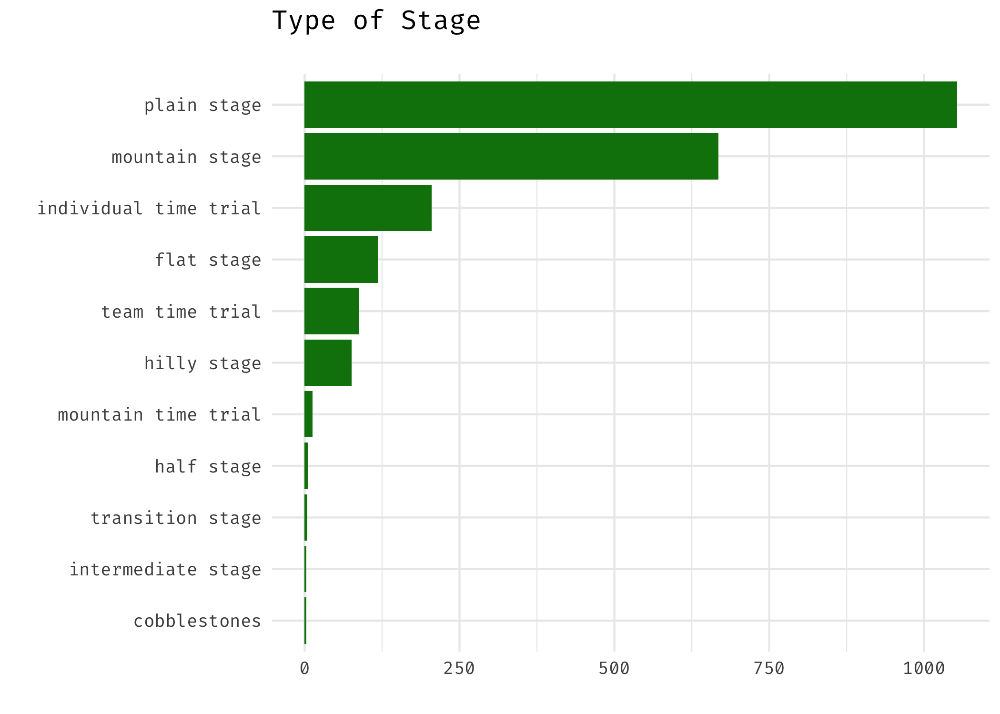
   
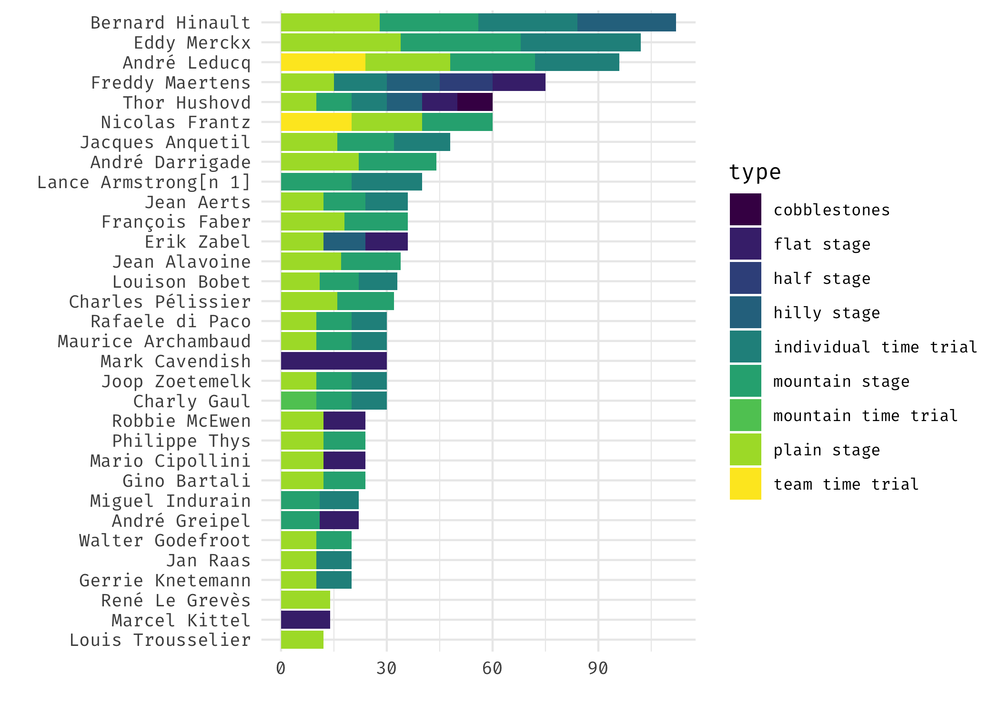
