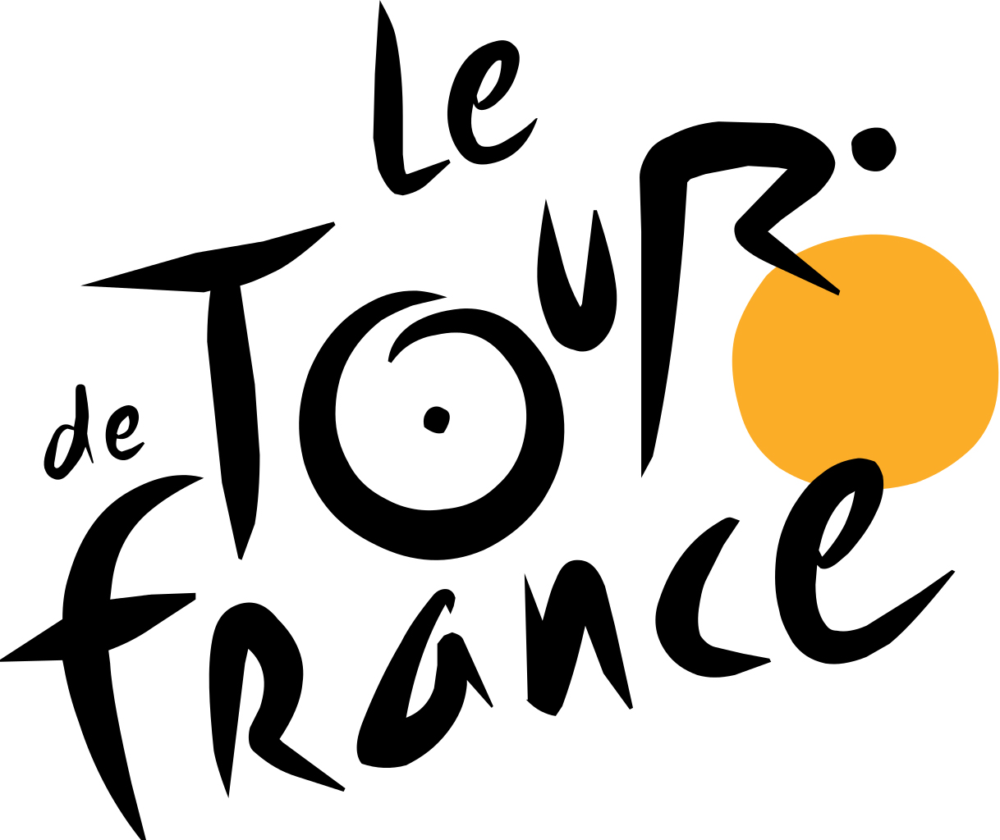

```{r setup, include=FALSE}
knitr::opts_chunk$set(echo = TRUE, fig.align = "center", echo = FALSE)
```


```{r, echo=FALSE, out.width='40%'}

```


# Tour de France Analysis 

<br>

If you know me, you know I'm a huge cycling fan. So when I saw this TidyTuesday dataset come up, I was sold. 


## Data Exploration


Let's load our libraries and get the data in to see what it looks like. 


```{r, warning = FALSE, message = FALSE}
library(tidyverse)
library(here)
library(janitor)
library(patchwork)
library(lubridate)
library(viridis)


tdf <- tidytuesdayR::tt_load('2020-04-07')
tdf_stage_wins <- tdf$stage_data %>% clean_names()
tdf_stages <- tdf$tdf_stages %>% clean_names()
tdf_winners <- tdf$tdf_winners %>% clean_names() %>% mutate(year = lubridate::year(start_date)) 

rm(tdf)
```

So, we have three datasets:

The `tdf_winners` data contains information about the different people who took part. It's not very big, as it has `106` rows, and `19` columns. 

```{r}
head(tdf_winners)
```

The `tdf_stage_wins` contains more detailed information about each year's race. It has information about who won each stage, what time the rider achieved, and how many points they gained. 

```{r}
tdf_stage_wins
```

The `tdf_stages` data contains information about the stage itself, such as the distance, type of stage, and destination. 


```{r}
tdf_stages
```


# Questions

Who won the most tournaments? 

WHAT COUNTRIES WERE THE MOST WINNERS BORN IN?


# TDF Winners Dataset


## Number of unique race winners and teams

```{r}
tdf_winners %>%
  summarise(winner_count = n_distinct(winner_name), 
            team_count = n_distinct(winner_team))


```

So, only 63 cyclists, but 106 editions. So some cyclists have won multiple. And only 48 different teams. 


## Top cyclists


```{r}
winners_plot <- tdf_winners %>% 
  group_by(winner_name) %>%
  summarise(count = n()) %>%
  arrange(desc(count)) %>%
  head(15) %>%
  ggplot() + 
  aes(x = reorder(winner_name, count), y = count) + 
  geom_col(fill = "#ECC615") + 
  coord_flip() + 
  ylab(" ") + xlab(" ") + ggtitle("Top winners in the Tour de France \n") + 
  theme(legend.position = "none", 
        panel.spacing.x = unit(2, "lines"),
        strip.text = element_blank(),
        plot.margin = unit(c(0.5, 0.5, 0, 0.5), "cm"), #top, right, bottom, left
        panel.border = element_blank()
        ) + 
  scale_y_continuous(breaks = c(1,2,3,4,5,6,7)) + 
  theme_minimal() +
  theme(text=element_text(family="Fira Code"))

winners_plot
```


```{r, eval = FALSE}
teams_plot <- tdf_winners %>% 
  group_by(winner_team) %>%
  summarise(count = n()) %>%
  arrange(desc(count)) %>%
  head(15) %>%
    ggplot() + 
  aes(x = reorder(winner_team, count), y = count) + 
  geom_col(fill = "#ECC615") + 
  coord_flip() + 
  scale_y_continuous(breaks = c(0:13)) + 
  theme(legend.position = "none", 
        panel.spacing.x = unit(2, "lines"),
        strip.text = element_blank(),
        plot.margin = unit(c(0.5, 0.5, 0, 0.5), "cm"), #top, right, bottom, left
        panel.border = element_blank()
        ) + 
  theme_minimal() +
  theme(text=element_text(family="Fira Code")) + 
  ylab(" ") + xlab(" ") + ggtitle("Top winning teams in the Tour de France \n") 

teams_plot 
```


## Most stage wins

```{r}
stage_wins_plot <- tdf_winners %>%
  group_by(winner_name) %>%
  summarise(totals = sum(stage_wins)) %>%
  arrange(desc(totals)) %>%
  head(15) %>%
    ggplot() + 
    aes(reorder(winner_name,totals), totals) + 
    geom_col(fill = "#067F0C") + 
    coord_flip() + 
  theme(legend.position = "none", 
        panel.spacing.x = unit(2, "lines"),
        strip.text = element_blank(),
        plot.margin = unit(c(0.5, 0.5, 0, 0.5), "cm"), #top, right, bottom, left
        panel.border = element_blank()
        ) + 
  theme_minimal() +
  theme(text=element_text(family="Fira Code")) + 
  ylab(" ") + xlab(" ") + ggtitle("Top Riders: stage wins \n") 

stage_wins_plot
```

```{r}
stage_leads_plot <- tdf_winners %>%
  group_by(winner_name) %>%
  summarise(totals = sum(stages_led)) %>%
  arrange(desc(totals)) %>%
  head(15) %>%
  ggplot() + 
  aes(reorder(winner_name,totals), totals) + 
  geom_col(fill = "#067F0C") + 
  coord_flip() + 
  theme(legend.position = "none", 
        panel.spacing.x = unit(2, "lines"),
        strip.text = element_blank(),
        plot.margin = unit(c(0.5, 0.5, 0, 0.5), "cm"), #top, right, bottom, left
        panel.border = element_blank()
        ) + 
  theme_minimal() +
  theme(text=element_text(family="Fira Code")) + 
  ylab(" ") + xlab(" ") + ggtitle("Top Riders: stage leads \n") 


stage_leads_plot
```

```{r, eval = FALSE}
plot <- stage_wins | stage_leads
  
  plot<- plot + 
  plot_layout(widths = c(0.1, 0.1)) +
  theme(panel.border = element_blank(),
        panel.grid = element_blank(),
        strip.background = element_blank(),
        strip.placement = NULL)
  
ggsave("test.png", plot)
```


# Countries with most winners

```{r}
countries_plot <- tdf_winners %>%
  group_by(nationality) %>%
  summarise(count = n()) %>%
  arrange(desc(count)) %>%
  ggplot(aes(x = reorder(nationality,count), y = count)) + 
  geom_col(fill = "red") + 
  coord_flip() + 
  xlab(" ") + ggtitle("Number of winners from each country")  + 
  theme(legend.position = "none", 
        panel.spacing.x = unit(2, "lines"),
        strip.text = element_blank(),
        plot.margin = unit(c(0.5, 0.5, 0, 0.5), "cm"), #top, right, bottom, left
        panel.border = element_blank()
        ) + 
  theme_minimal() +
  theme(text=element_text(family="Fira Code"))

countries_plot
```

# race distances over time

```{r}


distances_plot <- tdf_winners %>%
  ggplot(aes(x = year, y = distance)) + 
  geom_line(color = "red", size = 1) + 
  xlab("\n Race Year") + ylab("Distance (km) \n")  + 
  theme(legend.position = "none", 
        panel.spacing.x = unit(2, "lines"),
        strip.text = element_blank(),
        plot.margin = unit(c(1, 1, 1, 1), "cm"), #top, right, bottom, left
        panel.border = element_blank()
        ) + 
  theme_minimal() +
  theme(text=element_text(family="Fira Code")) 


distances_plot
```


```{r}
timings_plot <- tdf_winners %>%
  ggplot(aes(year, time_overall)) + 
  geom_line(color = "red", size = 1) + 
  xlab("\n Race Year") + ylab("Overall Time")  + 
  theme(legend.position = "none", 
        panel.spacing.x = unit(2, "lines"),
        strip.text = element_blank(),
        plot.margin = unit(c(0.5, 0.5, 0, 0.5), "cm"), #top, right, bottom, left
        panel.border = element_blank()
        ) + 
  theme_minimal() +
  theme(text=element_text(family="Fira Code"))

timings_plot
```


```{r, warning = FALSE, message = FALSE}
speed_plot <- tdf_winners %>%
  mutate(speed = distance / time_overall) %>%
  ggplot() + 
  aes(x = year, y = speed) + 
  geom_point(color = "Red") + 
  geom_smooth(color = "#ECC615", level = FALSE)  + 
  theme(legend.position = "none", 
        panel.spacing.x = unit(2, "lines"),
        strip.text = element_blank(),
        plot.margin = unit(c(0.5, 0.5, 0, 0.5), "cm"), #top, right, bottom, left
        panel.border = element_blank()
        ) + 
  theme_minimal() +
  theme(text=element_text(family="Fira Code"))

speed_plot

```

```{r}
tdf_winners %>%
  filter(distance == max(distance) | distance == min(distance)) %>%
  select(year, distance, winner_name)

```

```{r}
tdf_winners %>%
  drop_na(time_overall) %>%
  filter(time_overall == min(time_overall) | time_overall == max(time_overall)) %>%
  select(winner_name, time_overall)
```


# Stages


```{r}
tdf_stages <- tdf_stages %>%
  mutate(year = lubridate::year(date), 
         type = str_to_lower(type))

tdf_stages
```

```{r}
tdf_stages %>% 
  group_by(type) %>%
  summarise(totals = n()) %>%
  arrange(desc(totals)) %>%
  ggplot(aes(x = reorder(type,totals), y = totals)) + 
  geom_col(fill = "red") + 
  coord_flip() + 
  xlab("") + ylab("") + ggtitle("\n number of stage types") + 
  theme(legend.position = "none", 
        panel.spacing.x = unit(2, "lines"),
        strip.text = element_blank(),
        plot.margin = unit(c(0.5, 0.5, 0, 0.5), "cm"), #top, right, bottom, left
        panel.border = element_blank()
        ) + 
  theme_minimal() +
  theme(text=element_text(family="Fira Code"))
```


```{r}
tdf_stages %>% 
  select(winner, type) %>%
  group_by(winner) %>% 
  mutate(totals = n()) %>% 
  ungroup() %>% 
  filter(totals >= 10) %>% 
  # count(winner, type, totals, sort = TRUE) %>%
  arrange(winner) %>%
  distinct() %>%
  arrange(desc(totals)) %>%
ggplot(aes(x = reorder(winner, totals), y = totals, fill = type)) +
  geom_col() + 
  coord_flip()  + 
  theme(legend.position = "none", 
        panel.spacing.x = unit(2, "lines"),
        strip.text = element_blank(),
        plot.margin = unit(c(0.5, 0.5, 0, 0.5), "cm"), #top, right, bottom, left
        panel.border = element_blank()
        ) + 
  theme_minimal() +
  theme(text=element_text(family="Fira Code")) + 
  xlab("") + ylab("") + 
scale_fill_viridis(discrete=TRUE, option="magma")
```

